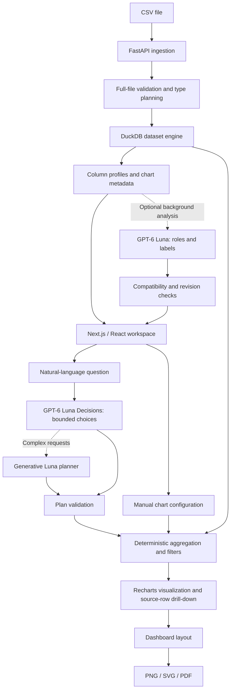

<div align="center">

# Analytico

**Turn CSV files into interactive charts and exportable dashboards.**

A local-first analytics app combining natural-language exploration, deterministic calculations, and optional AI-powered column understanding.

[Demo](#demo) · [Features](#features) · [Architecture](#architecture) · [Run locally](#run-locally)

</div>

## Demo

https://github.com/user-attachments/assets/4c3df7ed-f755-4f2b-91f6-d5cb18f45186

Upload a dataset, ask a question, explore the underlying records, and assemble a dashboard without writing analysis code.

## Features

| Capability | What you can do |
| --- | --- |
| **Natural-language charts** | Ask for comparisons, trends, totals, averages, or counts, including filters in your question. Clear supported requests produce a chart directly; material ambiguity receives clarification. |
| **Automatic CSV preparation** | Detect file settings, validate the full file, profile missing values, and recognize supported numeric, currency, percentage, and date formats. |
| **AI column understanding** | Enable GPT-6 Luna before upload to infer column roles and readable labels in the background. Start charting after local preparation; review or edit the schema whenever needed. |
| **Interactive exploration** | Build charts manually, apply structured filters, and drill into matching source rows. Overall answers appear as a single bar with its value. |
| **Dashboard builder** | Pin charts, drag and resize widgets, and save per-dataset layouts in browser storage. |
| **Exportable reports** | Download PNG/SVG chart assets or export a multi-page PDF dashboard. |

## Engineering highlights

- **AI plans; the engine calculates.** Model output passes through structured validation before execution. Pandas and DuckDB perform the aggregations; the app does not execute generated Python or model-written SQL.
- **Constrained chart planning.** GPT-6 Luna Decisions selects from real column keys, aggregations, chart styles and filter operands. A generative fallback handles more complex requests. Both receive dataset profiles, available descriptions and active filters, then use the same validated calculation engine.
- **A bounded ingestion engine.** CSVs use temporary disk-backed DuckDB at every size, preloaded at startup for fast first uploads. Native loading, full-source validation and bounded previews support larger datasets without putting every row into the browser.
- **Source-preserving interpretation.** Original CSV bytes are retained for the session, missing observations remain null, and conversions require full-column validation. AI display labels do not rename source keys or rewrite values.
- **Non-blocking enrichment.** A bounded background queue runs optional schema analysis. GPT-6 Luna Decisions classifies roles while Responses generates readable labels independently. Compatibility checks, user-override protection, and schema revisions prevent stale enrichment from overwriting reviewed choices.
- **One calculation path across interactions.** AI questions and manual charts share aggregation logic. Filters apply before calculation, and drill-down uses the same source filters as the chart.

## Architecture



The backend separates ingestion, schema review, query planning, aggregation, and enrichment into modules with validated request/response contracts. The frontend keeps chart interactions, dashboard layout, and export rendering in the local workspace.

## Automated data preparation

Analytico handles file validation, supported type conversions, missing-value profiling, and chart metadata automatically—reducing the manual setup needed to explore a new CSV.

| Dataset | Rows | Measured local engine preparation |
| --- | ---: | ---: |
| NYC green taxi | 1,068,755 | 8.51 s |
| Online retail | 541,909 | 2.05 s |

The chart-planning benchmark reached a **0.35-second median from question to computed chart**, down from 1.41 seconds, across supported requests on eight public datasets. [Benchmark scorecard](backend/benchmarks/results/query-decisions-2026-10-07/summary.json).

## Tech stack

| Layer | Technologies |
| --- | --- |
| Frontend | TypeScript, React 19, Next.js 16, Tailwind CSS |
| Visualization & interaction | Recharts, Framer Motion, react-grid-layout |
| Backend | Python, FastAPI, Pydantic |
| Data engine | DuckDB, pandas |
| AI | OpenAI GPT-6 Luna; Decisions, Responses, structured output and local validation |
| Export | html-to-image, jsPDF |
| Verification | Python unittest, TypeScript, frontend helper checks |

## Run locally

Use Python 3.11+ and a Node.js version compatible with Next.js 16. The tested backend environment is Python 3.14 on macOS. Python dependencies are pinned with hashes; frontend dependencies use `package-lock.json`.

**Backend**

```bash
cd backend
python -m venv venv
source venv/bin/activate
pip install --require-hashes --only-binary=:all: -r requirements.txt
cp -n .env.example .env
uvicorn main:app --host 127.0.0.1 --port 8000 --reload
```

On Windows, activate the virtual environment with `venv\Scripts\activate` and copy `.env.example` to `.env` using your shell.

**Frontend** — in a second terminal:

```bash
cd frontend
npm ci
npm run dev
```

Open [localhost:3000](http://localhost:3000). The included Gapminder dataset lets you explore immediately; the taxi demo requires a separately installed CSV.

For AI features, add your own `OPENAI_API_KEY` to `backend/.env`, which is ignored by Git. Chart planning and descriptions default to `gpt-6-luna`. The upload-time **AI column semantic analysis** toggle enables background role inference and a separate batched label request. Manual charts and local profiling work without a key; source headers remain visible when no AI or user label is available.

Chart planning uses Decisions by default. Set `QUERY_PLANNER_BACKEND=generative` in `backend/.env` to use the generative planner for every question.

Data preparation and calculations run locally. Enabled AI features send bounded dataset context to OpenAI; an API key also enables background summary generation. Dataset sessions use memory or temporary disk storage and cannot be reopened after a backend restart. Run the backend on localhost.

## Development checks

```bash
# Backend: from backend/ with the virtual environment active
pip install --require-hashes --only-binary=:all: -r requirements-dev.txt
python -m unittest discover -s tests -v

# Frontend: from frontend/
npx tsc --noEmit
npm run test:helpers
npm run lint
npm run build
```
